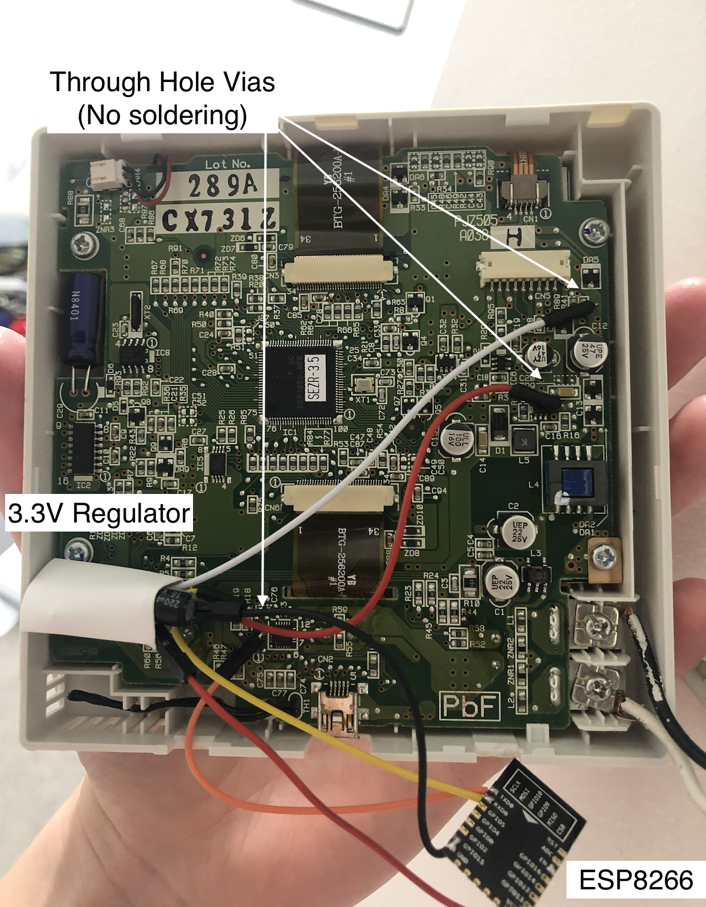
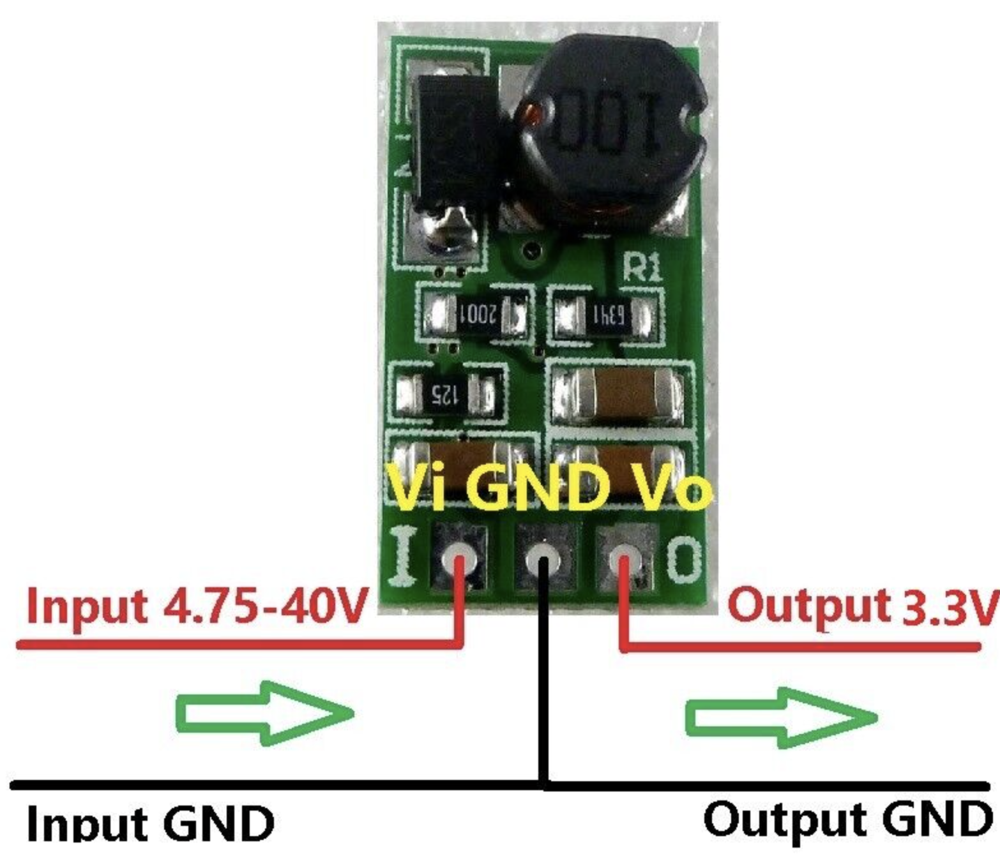
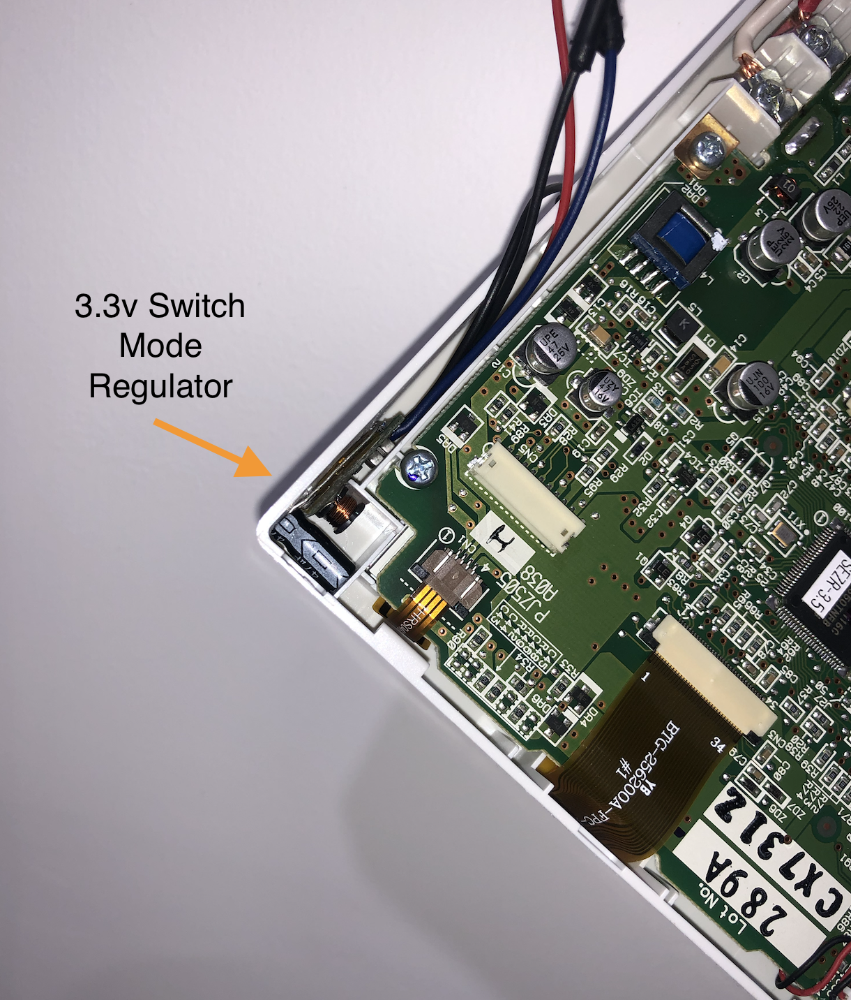
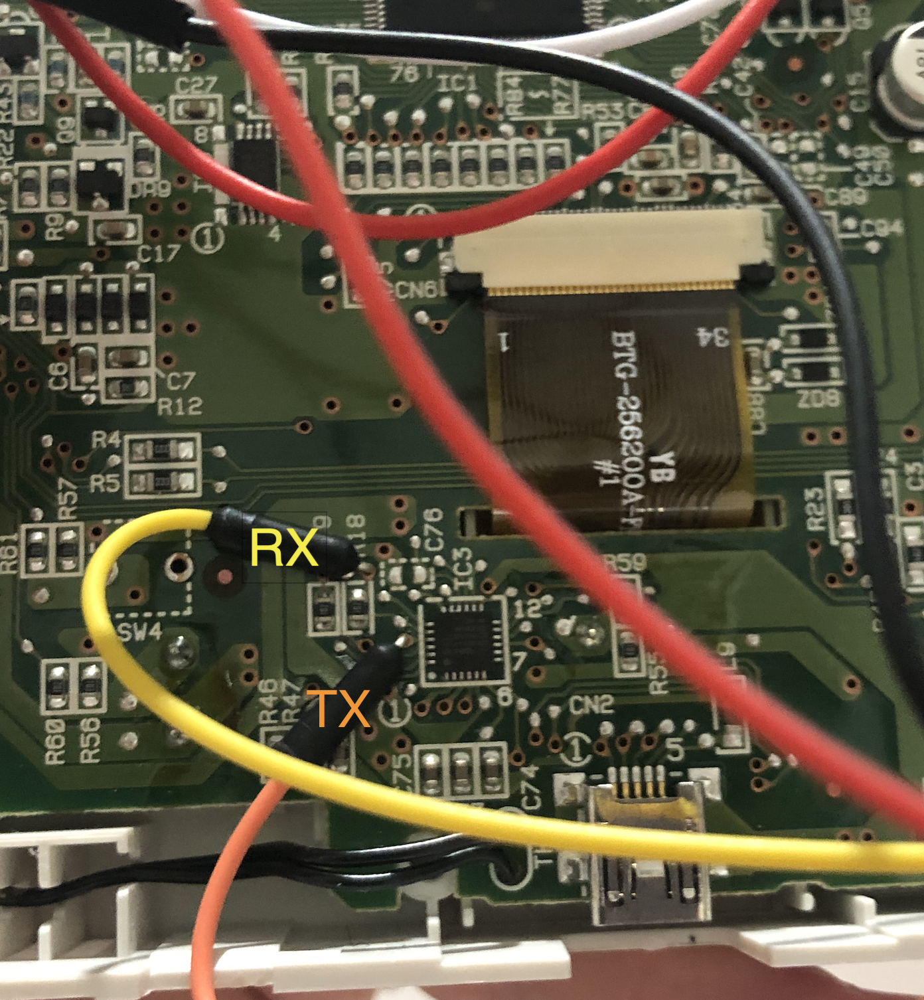
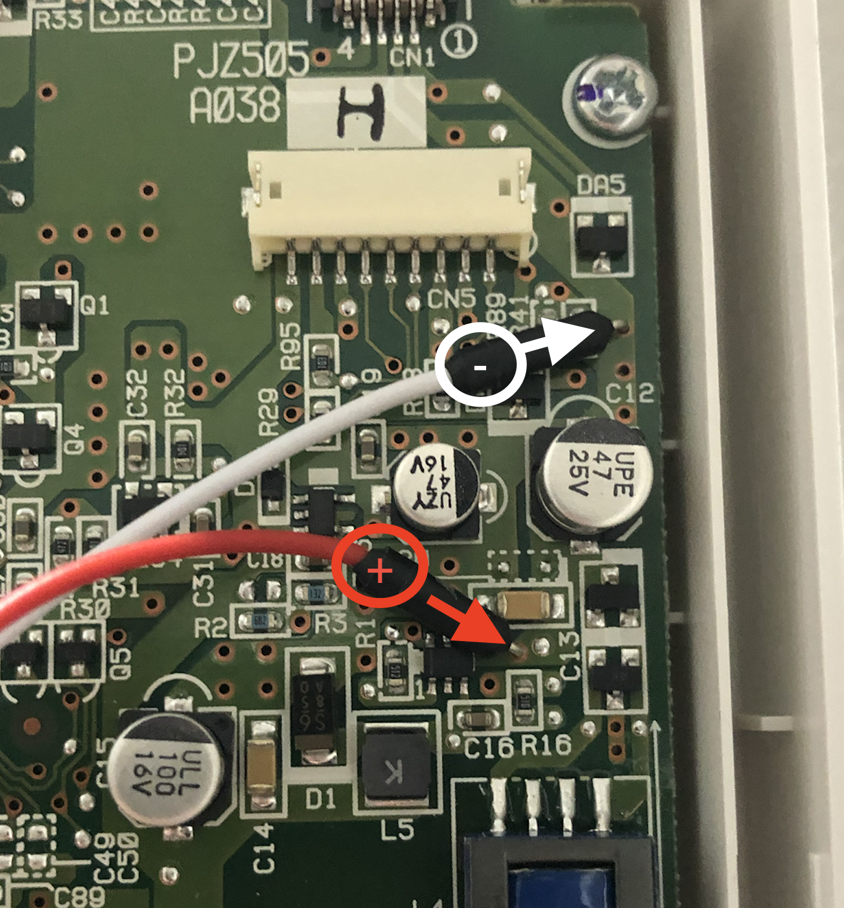

# WiFi Control for Mitsubishi (MHI) RC-EX3 and RC-EXZ3A Air Conditioner from Home Assistant

This project adds MQTT over Wifi control to the Mitsubishi RC-EX3/RC-EXZ3A wall controller using an ESP-12 (ESP8266). It is based on the excellent work from [mcchas/rc-ex3-esp](https://github.com/mcchas/rc-ex3-esp). Many thanks to the original author for providing the foundation.

Note: This project will work equally well on any of the ESP32 micro controllers.

## Project Objectives

The main objective of this project is for integration of my MHI (Mitsubishi Heavy Industries) HVAC system into Home Assistant.

### Compatible devices

As this adapter is implemented using the HVAC RC-EX3 remote control and should be compatible with all MHI HVAC that use the RC-EX3 remote.

This includes models in the following families:

* SRK
* SRR
* SRF
* FDTC
* FDUM
* FDEN
* FDT
* FDE
* FDUA (the device I'm using)

## Building the hardware

Build and flash the firmware to the ESP module. Connect VCC, GND, TX and RX to the panel by inserting bent jumper pins into the through-hole vias. Power the ESP-12 with a 3.3&nbsp;V regulator.

[](image.png)

Solder ground and positive leads to the regulator.

[](image.png)

Place the regulator inside the enclosure and press the jumper pins into the vias. The ESP-12 can sit flat against the PCB once insulated.

[](image.png)

[](image.png)

[](image.png)

[](image.png)


## Building

Open Build and Install using [PlatformIO](https://platformio.org).

## OTA Updating firmware

From the project open a platformIO terminal and, update using (replacing the device name with how you've configured it in `config-private.h`):

`pio run -t upload --upload-port mhi-ac-rc-ex3-1.local`

## Setup

Integrates into Home Assistant via MQTT discovery (set your MQTT user and pass in `config-private.h`)


Fetch the unit state with the status command and set the state with a JSON payload:

```
{
    "power": true/false,
    "mode": cool/dry/heat/fan/auto
    "fan_mode": auto/1/2/3/4
    "temp": 16.0-30.0
    "delayOffHours": 1-12
}
```

## Home Assistant

The firmware announces itself via MQTT discovery so it will appear automatically as a climate entity when the MQTT integration is enabled. Configure the broker settings in `config-private.h`.
Discovery uses the full MQTT property names as expected by recent Home Assistant releases (2025.7+). The discovery JSON is quite large so set `MQTT_MAX_PACKET_SIZE` to at least `1152` in `platformio.ini`.

Each attribute is published under `<BASE_TOPIC>/<item>`. With the default `BASE_TOPIC` of `mhi-ac-rc-ex3-1` the following topics are used:

- `mhi-ac-rc-ex3-1/power/state` (`.../set` to change)
- `mhi-ac-rc-ex3-1/mode/state`
- `mhi-ac-rc-ex3-1/temp/state`
- `mhi-ac-rc-ex3-1/fan_mode/state`

Updates from the wall controller are pushed over MQTT so Home Assistant always reflects the latest state.
